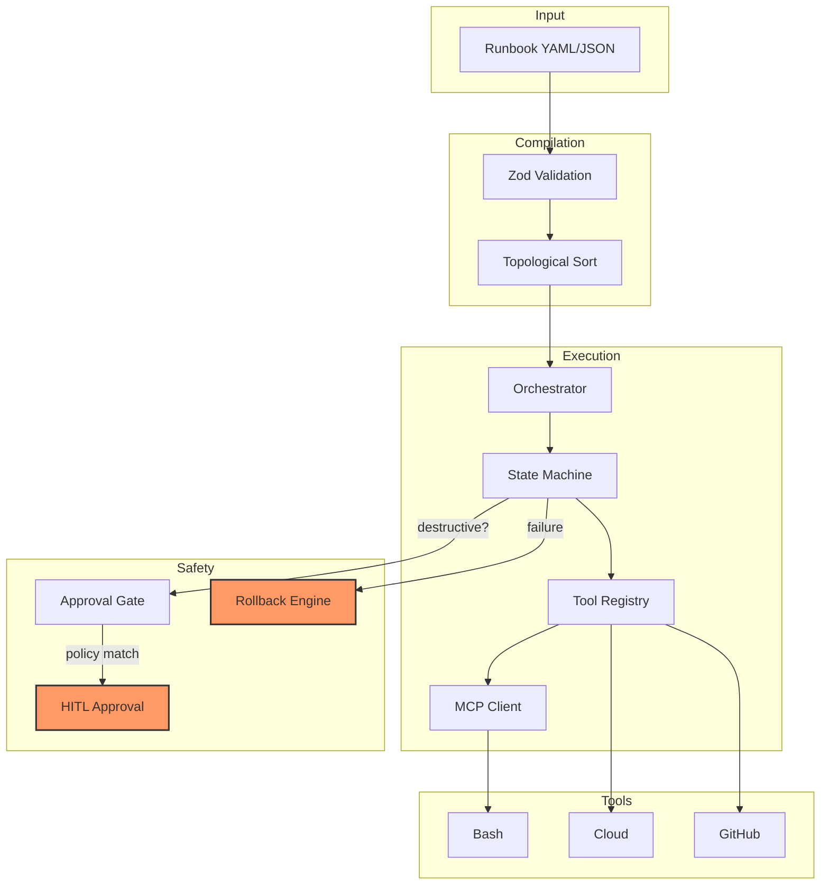

# Multi-Agent DevOps Runbook Orchestrator

> A TypeScript engine that compiles infrastructure runbooks into typed state-machine executions.
> Agents discover tools via the Model Context Protocol (MCP), execute tasks in dependency order,
> halt at [Human-in-the-Loop (HITL)](#human-in-the-loop-hitl) gates for destructive actions,
> and roll back on failure.



## Why TypeScript?

This project uses compile-time type safety to prevent runtime orchestration failures:

- **Discriminated unions** (`AgentState = Idle | Executing | AwaitingApproval | Failed | Completed`) make invalid state transitions a **compile error**, not a runtime bug. You cannot accidentally transition from `failed` to `executing` without resetting.
- **Zod schemas** validate every tool input at runtime — an LLM cannot hallucinate malformed arguments and crash the engine.
- **The tool registry** is generic over input/output types: `Tool<TInput, TOutput>`. Registering a tool with a Zod schema means the orchestrator parses every payload before execution.
- **`strict: true` with `noUncheckedIndexedAccess`** ensures every Map/Array access is typed as potentially `undefined` — you handle the missing case at compile time.

In short: if a state transition is invalid or a tool argument is wrong, TypeScript catches it **during CI**, not during production incident response.

## Architecture

```
src/
├── index.ts                  # Entry point with example runbook
├── types/
│   ├── agent.ts              # Agent state machine (discriminated unions)
│   └── runbook.ts            # Runbook schema + topo sort (Zod)
├── engine/
│   ├── state-machine.ts      # Orchestrator state machine
│   ├── tool-registry.ts      # Type-safe tool registry with Zod
│   └── orchestrator.ts       # Main execution orchestrator
├── mcp/
│   └── client.ts             # MCP (Model Context Protocol) client
├── hitl/
│   └── approval-gate.ts      # Policy-based approval gate
└── tools/
    ├── mock-bash.ts           # Allowlisted bash executor (mock)
    └── mock-cloud.ts          # Cloud operations executor (mock)
```

### Agent State Machine

The agent lifecycle is modeled as a **discriminated union**:

```typescript
type AgentStatus =
  | { status: 'idle'; agentId: string }
  | { status: 'executing'; tool: string; payload: Record<string, unknown> }
  | { status: 'awaiting_approval'; executionId: string; policyViolation: string }
  | { status: 'completed'; taskId: string; result: unknown }
  | { status: 'failed'; error: Error; rollbackStep: string | null }
  | { status: 'rolled_back'; taskId: string; rollbackResult: unknown }
```

Each variant carries **only the fields valid for that state**. An `idle` agent has no tool or payload; a `completed` agent has no error. Transitions are pure functions (`applyEvent`).

### Tool Registry with Runtime Validation

Every tool registers a Zod schema. When an agent calls a tool, the registry **parses the input at runtime** before execution:

```typescript
const bashTool: Tool<BashInput, BashOutput> = {
  name: 'bash',
  inputSchema: z.object({
    command: z.string().min(1),
    cwd: z.string().optional(),
    timeout_seconds: z.number().int().positive().default(60),
  }),
  execute: async (input) => { /* sandboxed execution */ },
}
```

If an LLM hallucinates `{ command: 123 }` instead of `{ command: "ls" }`, Zod rejects it before the tool runs.

### Human-in-the-Loop (HITL) Gates

Destructive actions pass through the `ApprovalGate`, which evaluates task descriptions against policy patterns:

| Policy | Pattern | Severity |
|--------|---------|----------|
| Resource Deletion | `delete\|remove\|destroy\|terminate` | Critical |
| Credential Rotation | `rotate\|revoke\|reset.*key` | High |
| IAM Change | `iam.*attach\|iam.*detach` | High |
| Network Change | `security-group\|firewall\|acl` | High |
| Data Export | `export\|backup.*external` | Medium |

When a policy matches, the state machine transitions to `awaiting_approval` and stops. Only an explicit approval signal resumes execution.

### MCP Client

The built-in MCP client connects to any MCP-compliant server over stdio (JSON-RPC 2.0). Agents discover tools via `tools/list` and execute via `tools/call`. Types match the MCP specification.

## Getting Started

```bash
# Install
npm install

# Type-check
npm run typecheck

# Run tests
npm test

# Run the example orchestrator
npm start
```

The example runbook demonstrates a credential rotation workflow:
1. Audit current IAM key ages
2. Generate a new key (HITL gate triggered — destructive)
3. Update GitHub Actions secret with new key
4. Verify new key works
5. Deactivate old key (HITL gate triggered — destructive)

## CI/CD

Every push runs `tsc --noEmit --strict` and `vitest`:

```yaml
# .github/workflows/ci.yml
jobs:
  typecheck-and-test:
    runs-on: ubuntu-latest
    steps:
      - uses: actions/checkout@v4
      - uses: actions/setup-node@v4
      - run: npm ci
      - run: npm run typecheck
      - run: npm test
```

## Stack

- **TypeScript 5.9** — strict mode, `noUncheckedIndexedAccess`, `exactOptionalPropertyTypes`
- **Zod** — runtime validation at every external boundary
- **Vitest** — async integration tests
- **MCP** — Model Context Protocol for tool discovery
- **Node.js 20+** — ESM modules

## Targeting Kindo

This project demonstrates three capabilities Kindo looks for in AI-platform engineers:

1. **Agent Architecture** — typed state machines for autonomous multi-agent execution
2. **DevSecOps Automation** — policy-aware runbook execution with HITL approval gates
3. **Type Safety at Scale** — compile-time + runtime validation preventing LLM hallucinations from reaching infrastructure
